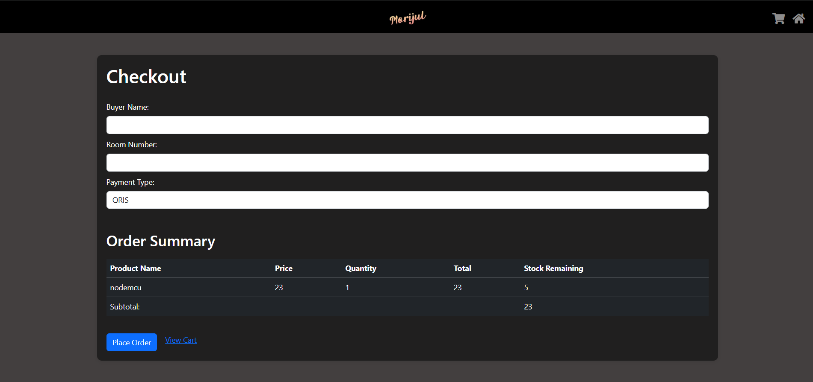
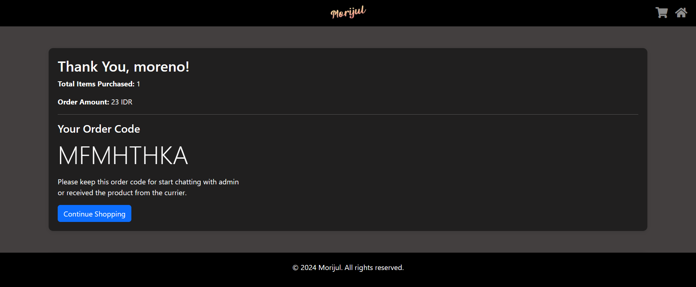
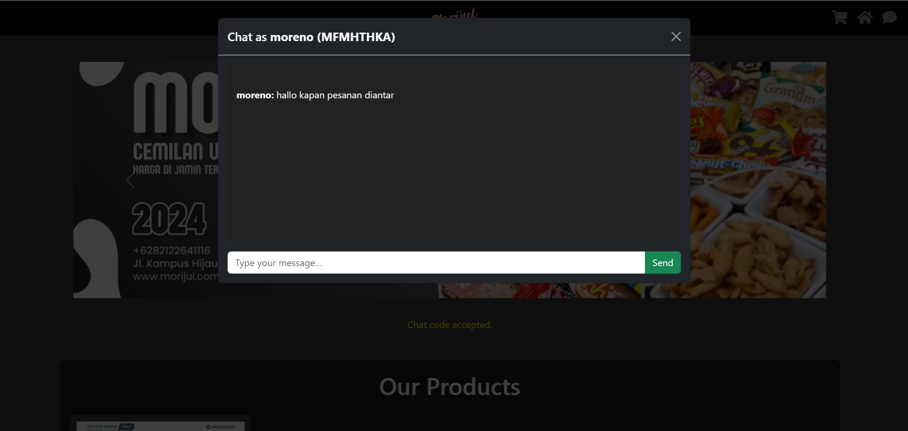
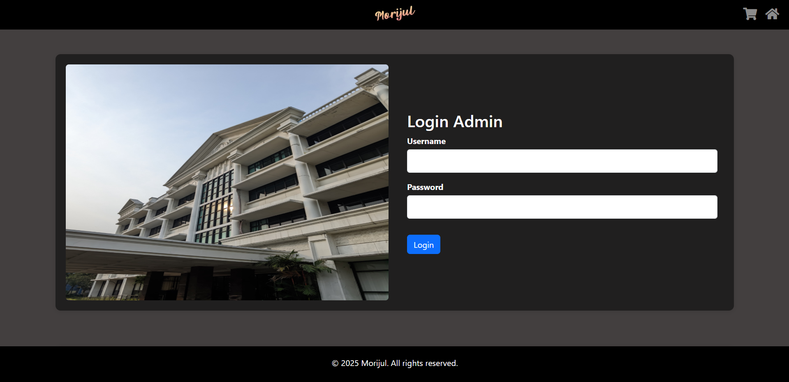
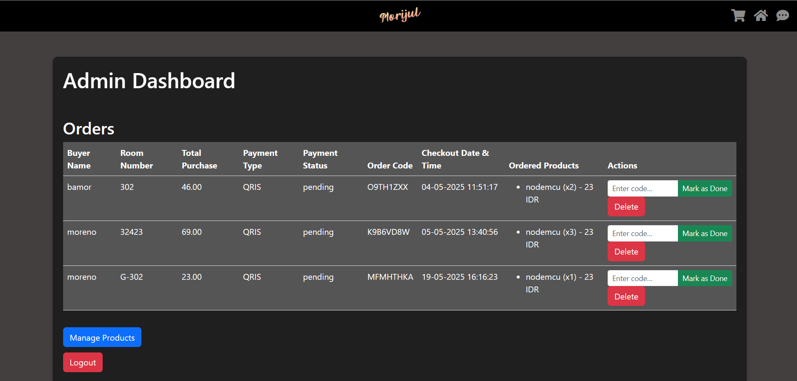
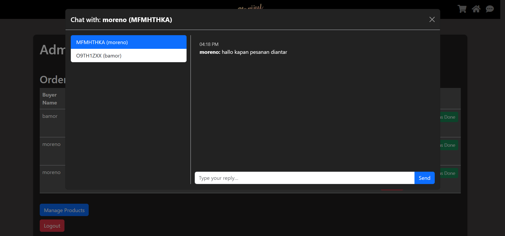
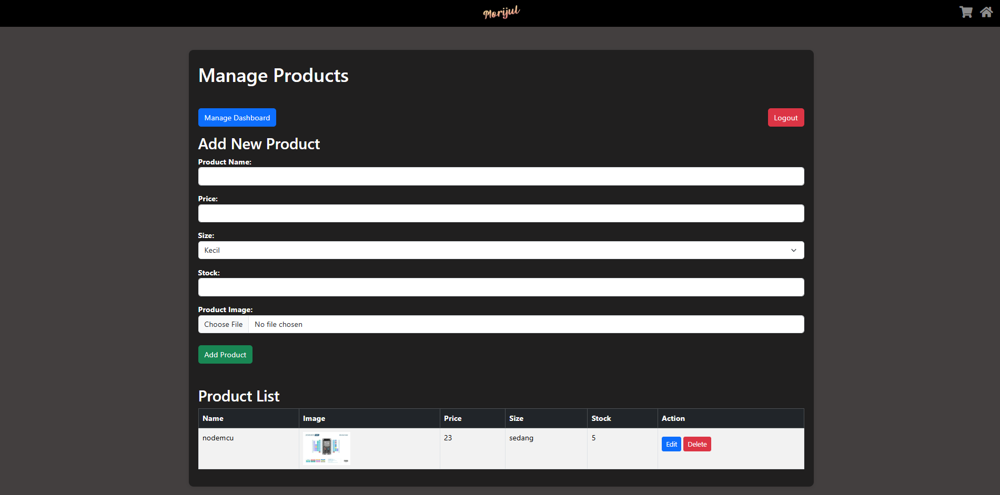
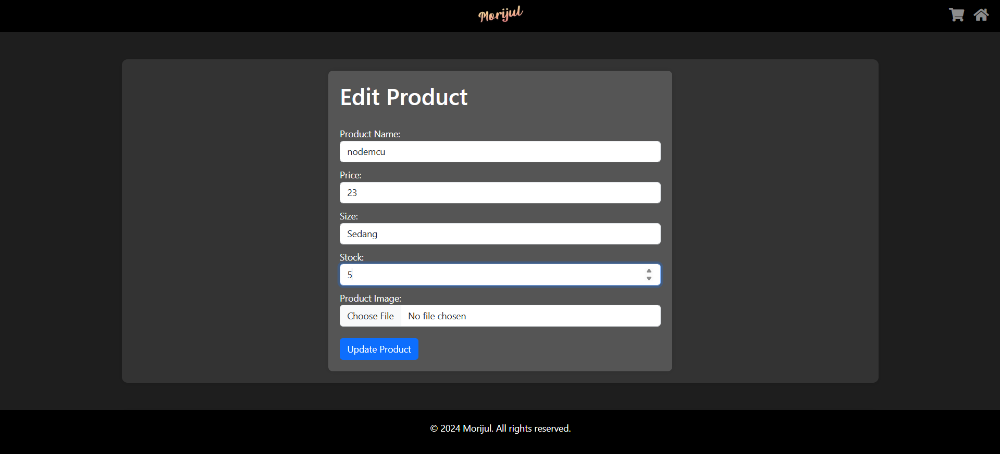
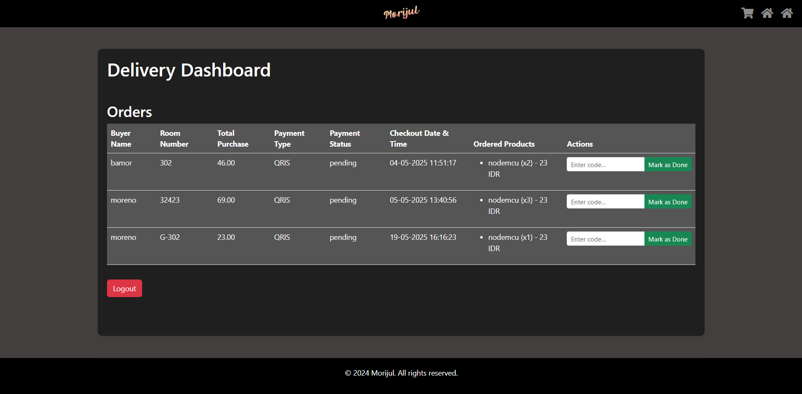

# OOSS

> A Shopee-like clone E-commerce app serving the basic needs of President University dorm residents.

---

## Table of Contents

* [About](#about)
* [Team](#team)
* [Tech Stack](#tech-stack)
* [Features](#features)
* [Installation](#installation)
* [Usage](#usage)
* [Database Schema](#database-schema)
* [Flowchart](#flowchart)
* [Pages User](#pagesu)
* [Pages Admins](#pagesa)
* [Project 2: Employee Management System](#project-2-employee-management-system)
* [Contributing](#contributing)
* [License](#license)

---

## About

Hello sir, this is the captain speaking. Our group consists of 3 people and 1 AI:

> Project SSIP: My project is called **MoRiJul** (Moreno, Rifqi, Zuldan) a clone of Shopee E-commerce, built to serve the basic needs of people at President University Dorm.

* **Framework**: Laravel
* **CSS Framework**: Bootstrap
* **Session-based cart**: Users (buyers) can browse and shop without logging in because I use session data for cart.

---

## Team

| Name                   | Role              |
| ---------------------- | ----------------- |
| Rifqi Athallah Rizaldi | Frontend & Design |
| Zuldan Fahrizal Rahman | Frontend & Design |
| Moreno Dwiputra        | Backend           |
| ChatGPT                | Backend Assistant |

---

## Tech Stack

* **Backend**: PHP, Laravel 11
* **Frontend**: HTML, Blade Templates, Bootstrap 5.3
* **Database**: MySQL
* **Session Management**: Laravel Sessions

---

## Features

* Product listing with variations (e.g., size)
* Add to cart (session storage)
* Chat between Admin & User using a unique code
* Admin login and dashboard
* Order management: view buyer details, room number, payment type/status
* Payment options: Cash on Delivery (COD), QRIS (integration pending)
* Responsive design for desktop and mobile

---

## Installation

1. **Clone the repository**

   ```bash
   git clone https://github.com/KuroBapak/OOSS.git
   cd morijul-ooss
   ```

2. **Install dependencies**

   ```bash
   composer install
   npm install && npm run dev
   ```

3. **Environment setup**

   * Copy `.env.example` to `.env`
   * Set database credentials
   * Generate application key:

     ```bash
     php artisan key:generate
     ```

4. **Database migration & seeding**

   ```bash
   php artisan migrate --seed
   ```

5. **Serve the app**

   ```bash
   php artisan serve
   ```

---

## Usage

1. Open your browser and navigate to `http://127.0.0.1:8000`
2. Browse products and add items to your cart (no login required).
3. To access the admin dashboard, click the **Morijul Logo** button and log in with your admin credentials.
4. Manage orders and update payment status from the dashboard.

---

## Database Schema


| Table            | Column          | Type            | Key                     | Notes / Relations                                      |
| ---------------- | --------------- | --------------- | ----------------------- | ------------------------------------------------------ |
| **admins**       | id              | BIGINT UNSIGNED | PK                      |                                                        |
|                  | username        | VARCHAR(50)     |                         |                                                        |
|                  | password        | VARCHAR(255)    |                         |                                                        |
|                  | role            | VARCHAR(20)     |                         |                                                        |
|                  | created\_at     | TIMESTAMP       |                         |                                                        |
|                  | updated\_at     | TIMESTAMP       |                         |                                                        |
| **products**     | id              | BIGINT UNSIGNED | PK                      |                                                        |
|                  | name            | VARCHAR(100)    |                         |                                                        |
|                  | image           | VARCHAR(255)    |                         |                                                        |
|                  | price           | DECIMAL(10,2)   |                         |                                                        |
|                  | size            | ENUM            |                         | Values: 'kecil', 'sedang', 'besar'                     |
|                  | stock           | INT             |                         |                                                        |
|                  | created\_at     | TIMESTAMP       |                         |                                                        |
|                  | updated\_at     | TIMESTAMP       |                         |                                                        |
| **orders**       | id              | BIGINT UNSIGNED | PK                      |                                                        |
|                  | buyer\_name     | VARCHAR(100)    |                         |                                                        |
|                  | room\_number    | VARCHAR(10)     |                         |                                                        |
|                  | payment\_type   | VARCHAR(20)     |                         | e.g., 'COD', 'QRIS'                                    |
|                  | payment\_status | ENUM            |                         | Values: 'pending', 'paid', 'failed'; default 'pending' |
|                  | total\_amount   | DECIMAL(10,2)   |                         |                                                        |
|                  | order\_code     | VARCHAR(50)     |                         | Unique code                                            |
|                  | created\_at     | TIMESTAMP       |                         |                                                        |
|                  | updated\_at     | TIMESTAMP       |                         |                                                        |
| **order\_items** | id              | BIGINT UNSIGNED | PK                      |                                                        |
|                  | order\_id       | BIGINT UNSIGNED | FK → orders.id          | Defines items in an order                              |
|                  | product\_id     | BIGINT UNSIGNED | FK → products.id        |                                                        |
|                  | quantity        | INT             |                         |                                                        |
|                  | price           | DECIMAL(10,2)   |                         | Snapshot of product price at order time                |
|                  | created\_at     | TIMESTAMP       |                         |                                                        |
|                  | updated\_at     | TIMESTAMP       |                         |                                                        |
| **chats**        | id              | BIGINT UNSIGNED | PK                      |                                                        |
|                  | order\_code     | VARCHAR(50)     | FK → orders.order\_code | Enables chat per order                                 |
|                  | sender          | ENUM            |                         | Values: 'user','admin','delivery'                      |
|                  | message         | TEXT            |                         |                                                        |
|                  | created\_at     | TIMESTAMP       |                         |                                                        |
|                  | updated\_at     | TIMESTAMP       |                         |                                                        |
| **sessions**     | id              | VARCHAR(255)    | PK                      |                                                        |
|                  | user\_id        | BIGINT UNSIGNED |                         | Nullable (session owner)                               |
|                  | ip\_address     | VARCHAR(45)     |                         |                                                        |
|                  | user\_agent     | TEXT            |                         |                                                        |
|                  | payload         | LONGTEXT        |                         | Serialized session data                                |
|                  | last\_activity  | INT             |                         | UNIX timestamp of last activity                        |

**Relationships:**

* **orders** ➔ **order\_items**: One-to-many (orders.id → order\_items.order\_id)
* **products** ➔ **order\_items**: One-to-many (products.id → order\_items.product\_id)
* **orders** ➔ **chats**: One-to-many (orders.order\_code → chats.order\_code)

---

## Flowchart


The flowchart illustrates the user journey and admin processes.

---

## Pages User

1. **Home**: Product showcases
2. **Product**: Detailed view, add to cart
3. **Cart**: Session-based cart summary
4. **Payment**: Choose COD or QRIS, proceed to order
5. **Order Code**: Randomly generated unique code used for chatting between admin and user
6. **Chat Interface**: User chat interface






---

## Pages Admins

1. **Admin Login**: Secure access for admin
2. **Admin Dashboard**: Order list, update payment status, chat to user
3. **Admin Chat**: Admin chat interface
4. **Admin Product**: List of added product to the catalog. Add, delete & edit
5. **Admin Edit**: Admin edit product view
6. **Delivery Page**: Delivery man page for validating order code and updating status








---

## Project 2: Employee Management System

> A Java-based Employee Attendance and Payroll system with roles for Admin, HRD, and Employee.

---

### Tech Stack

* **Language & IDE**: Java (NetBeans)
* **Database**: MySQL
* **Framework**: JDBC

---

### Features & Views

* **Admin View** (CRUD Admin & Employee; Salary & Department filter)

  1. Dashboard with employee list, salary and department filters
  2. Add Admin, Edit Admin
  3. Add Employee, Edit Employee
* **HRD View** (Attendance & Payment Management)

  1. Add/Edit absence records
  2. Update payment status
* **Employee View** (Read-Only)

  1. View attendance, payment status, total payment

---

### Database Schema


| Table         | Column       | Type                | Key               | Relations / Notes                  |
| ------------- | ------------ | ------------------- | ----------------- | ---------------------------------- |
| **employees** | ID           | INT AUTO\_INCREMENT | PK                | Stores employee details            |
|               | Name         | VARCHAR(100)        |                   |                                    |
|               | Department   | VARCHAR(50)         |                   |                                    |
|               | Salary       | DECIMAL(10,2)       |                   |                                    |
|               | address      | VARCHAR(255)        |                   |                                    |
|               | pay\_card    | VARCHAR(50)         |                   |                                    |
|               | emp\_type    | ENUM                |                   | 'Employee','Contract'              |
| **users**     | user\_id     | INT AUTO\_INCREMENT | PK                | Login credentials and role mapping |
|               | username     | VARCHAR(50)         | UNIQUE            |                                    |
|               | password     | VARCHAR(255)        |                   |                                    |
|               | role         | ENUM                |                   | 'Admin','HRD','Employee'           |
|               | emp\_id      | INT                 | FK → employees.ID |                                    |
| **absences**  | absence\_id  | INT AUTO\_INCREMENT | PK                | Attendance records per month       |
|               | emp\_id      | INT                 | FK → employees.ID |                                    |
|               | month        | DATE                |                   | Month of record                    |
|               | days\_missed | INT                 |                   |                                    |
|               | status       | ENUM                |                   | 'Done','Not Yet' default 'Not Yet' |

---

### Flowchart


---

## Contributing

Contributions are welcome! Please open an issue or submit a pull request.

---

## License

This project is licensed under the Bamor License.
