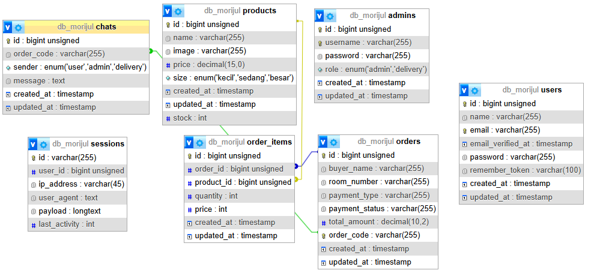
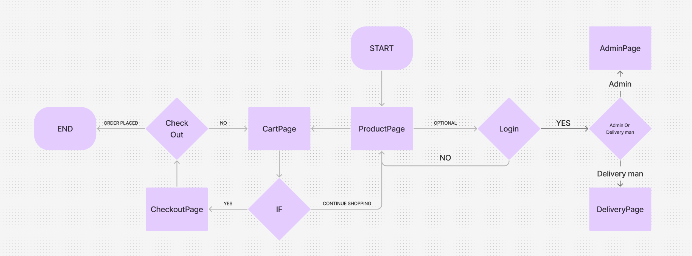
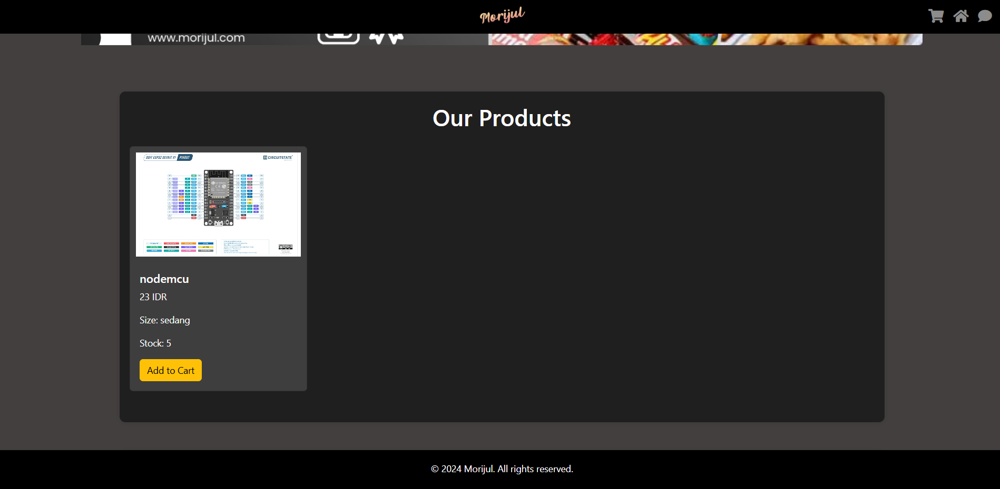
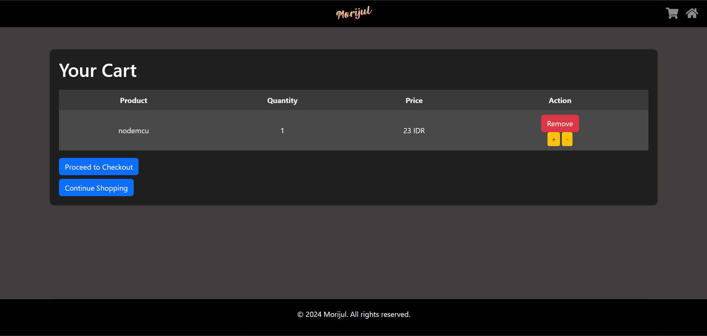

# OOSS

> A Shopee-like clone E-commerce app serving the basic needs of President University dorm residents.

---

## Table of Contents

* [About](#about)
* [Team](#team)
* [Tech Stack](#tech-stack)
* [Features](#features)
* [Installation](#installation)
* [Usage](#usage)
* [Database Schema](#database-schema)
* [Flowchart](#flowchart)
* [Pages](#pages)
* [Contributing](#contributing)
* [License](#license)

---

## About

Hello sir, this is the captain speaking. Our group consists of 3 people and 1 AI:

> Project SSIP: My project is called **MoRiJul** (Moreno, Rifqi, Zuldan) — a clone of Shopee E-commerce, built to serve the basic needs of people at President University Dorm.

* **Framework**: Laravel
* **CSS Framework**: Bootstrap
* **Session-based cart**: Users (buyers) can browse and shop without logging in; sessions manage cart data.

---

## Team

| Name                   | Role              |
| ---------------------- | ----------------- |
| Rifqi Athallah Rizaldi | Frontend & Design |
| Zuldan Fahrizal Rahman | Frontend & Design |
| Moreno Dwiputra        | Backend           |
| ChatGPT                | Backend Assistant |

---

## Tech Stack

* **Backend**: PHP, Laravel 11
* **Frontend**: HTML, Blade Templates, Bootstrap 5.3
* **Database**: MySQL
* **Session Management**: Laravel Sessions

---

## Features

* Product listing with variations (e.g., size)
* Add to cart (session storage)
* Admin login and dashboard
* Order management: view buyer details, room number, payment type/status
* Payment options: Cash on Delivery (COD), QRIS (integration pending)
* Responsive design for desktop and mobile

---

## Installation

1. **Clone the repository**

   ```bash
   git clone https://github.com/yourusername/morijul-ooss.git
   cd morijul-ooss
   ```

2. **Install dependencies**

   ```bash
   composer install
   npm install && npm run dev
   ```

3. **Environment setup**

   * Copy `.env.example` to `.env`
   * Set database credentials
   * Generate application key:

     ```bash
     php artisan key:generate
     ```

4. **Database migration & seeding**

   ```bash
   php artisan migrate --seed
   ```

5. **Serve the app**

   ```bash
   php artisan serve
   ```

---

## Usage

1. Open your browser and navigate to `http://127.0.0.1:8000`
2. Browse products and add items to your cart (no login required).
3. To access the admin dashboard, click the **Admin** button and log in with your admin credentials.
4. Manage orders and update payment status from the dashboard.

---

## Database Schema



Here is the structure of the main tables:

* **users**: stores admin credentials
* **products**: product details and variations
* **orders**: order header with buyer info
* **order\_items**: line items linked to orders
* **payments**: payment type & status

---

## Flowchart



The flowchart illustrates the user journey and admin processes.

---

## Pages

1. **Home**: Product showcase with search/filter options
2. **Product**: Detailed view, variation selection, add to cart
3. **Cart**: Session-based cart summary
4. **Payment**: Choose COD or QRIS, proceed to order
5. **Admin Login**: Secure access for admin
6. **Admin Dashboard**: Order list, update payment status





---

## Contributing

Contributions are welcome! Please open an issue or submit a pull request.

---

## License

This project is licensed under the MIT License. See the [LICENSE](LICENSE) file for details.
